这是一个机器学习的教程: a Tutorial to Machine Learning

这是 [a series of projects]() 中的第一个项目，从这个项目中我们会学习到如何使用机器学习中的经典算法来实现泰坦尼克号幸存者分析和预测。

需要大家了解机器学习的基本知识，同时要掌握机器学习中的经典模型，比如logistic regression，svm 等。

项目使用 `sklearn` 和 `python3.7`

# 目录

[**Objective**](https://github.com/tensorinfinity/Titanic#objective)

[**Concepts**](https://github.com/tensorinfinity/Titanic#concepts)

[**Overview**](https://github.com/tensorinfinity/Titanic#overview)

[**Implementation**](https://github.com/tensorinfinity/Titanic#implementation)

[**Training**](https://github.com/tensorinfinity/Titanic#training)

[**Evaluation**](https://github.com/tensorinfinity/Titanic#evaluation)


# Objective
我们需要训练一个机器学习的算法来判断在泰坦尼克号中哪些人存活的概率更高，哪些人存活的概率更低。

在这个项目中，我们主要使用数据可视化分析以及经典的机器学习算法来进行练习。

# Concepts

- **数据可视化** 一般来讲使用 `matplotlib` 和 `seaborn` 就能够提供我们基本的绘图需求，比较常用的图表有：
    - 查看目标分布的图表，当分布不平衡的时候，可以通过这个图标观察到
    - 散点图，可以观察到特征的分布趋势以及是否有outlier的存在
    - 多个变量之间的相关图图片，可以看出一定的依赖关系

- **数据预处理** 对于得到的数据，在进行构造特征之前，我们需要对数据进行预处理，因为数据存在着缺失等问题，一般的预处理步骤如下：
    - 合并不同文件夹中的特征
    - 处理确实数据
    - 处理离群点
    - 将一些特征转换成 Categorical Variable

这部分的处理策略依赖于数据可视化中的分析和结果。

- **交叉验证** 这对于模型的选择是一个非常重要的步骤，能够知道模型是否过拟合了，是不是能够真正generalize到测试集上。当数据的分布随机均衡的情况下，**5-Fold CV** 就已经足够了，如果不放心，可以使用 **10-Fold**。

<div align=center>
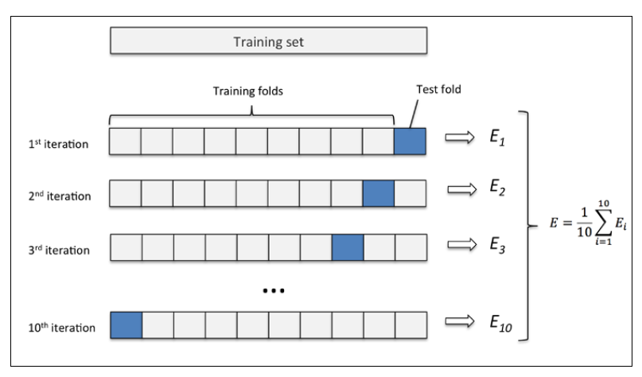
</div>

- **格点搜索** 有的模型有很多超参数需要调整，比如决策树中我们需要设置最大深度，分裂所需最小节点数等等，这些参数的不同组合非常的多，使用格点搜索就是我们将所有可能的参数都列出来，然后穷举所有的组合进行训练和测试，得到性能最好的参数组合。

<div align=center>
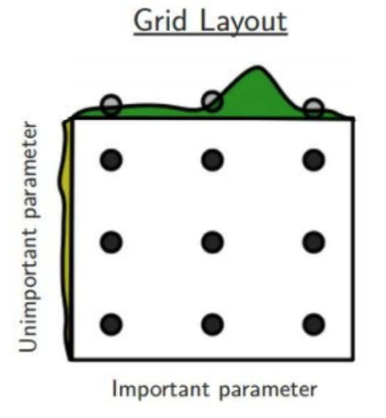
</div>

- **Ensemble** 模型融合是机器学习里面非常常见的技术，是将多个不同的弱分类器集成得到一个强分类器，可以同时降低模型的 Bias 和 Variance，在提高模型表现的同时又能降低过拟合的风险。Ensemble的效果要好，不同的弱分类器之间相关性尽可能小，这样能够增加集成模型的多样性，同时弱分类器之间的性能差距不能太大，否则会拉低集成模型的性能。常见的 Ensemble 方法有下面几种：
    - Bagging: 对训练集进行随机采样得到不同的子集来训练弱分类器，然后对弱分类器进行投票。
    - Boosting: 迭代训练弱分类器，根据上一次迭代中预测错误的情况进行修正训练样本的权重。
    - Blending: 用不相关的训练集进行不同弱分类器的训练，最后将它们的输出取加权平均得到最后的预测结果。
    - Stacking

<div align=center>
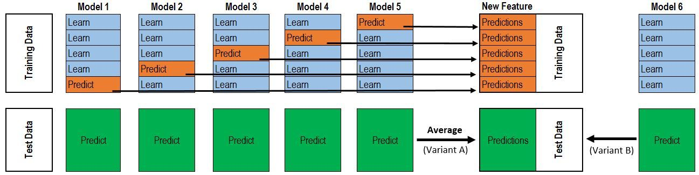
</div>


# Overview
在这个部分，我们展示一下整体的结构，如果你很熟悉这个部分，你可以直接跳到[implementation](https://github.com/tensorinfinity/Titanic#implementation)

## 数据可视化分析
首先，我们对数据进行可视化，分析其中的关系。

首先我们对数据中所有特征进行缺失值的可视化，可以发现年龄和船舱号码确实比较多，其中年龄大概缺少五分之一，而船舱号码大概只要10%不到，所以后面我们会尽量去填补年龄的特征，同时去掉船舱号码这一个特征。

<div align=center>
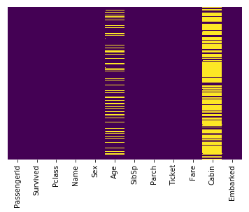
</div>

下面我们分析存活的人和遇难的人的比例，发现存活的人大概只有遇难的人的二分之一，这里可以说明训练集有一点类别不均衡，两个类别的数据并不是一样多的。

<div align=center>
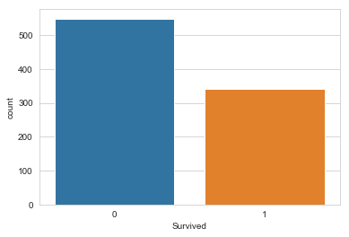
</div>


接着我们考虑性别和存活应该存在一定的关系，应该女性幸存的人数更多，通过下面的可视化我们发现了确实是这样的，在遇难的人数中，大多数是男性，而幸存的人数中，大多是女性。

<div align=center>
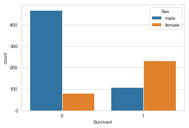
</div>

接着我们考虑船舱等级和幸存者之间的关系，通过下面的图我们发现幸存者中每种船舱等级大多一致，而遇难的人中，大多数是三等船舱。

<div align=center>
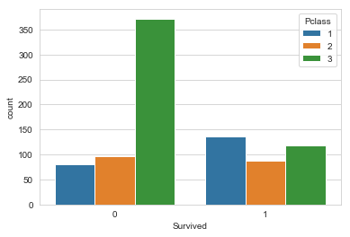
</div>

然后我们查看一下年龄分布，发现大多数人集中在20-40岁之间。

<div align=center>
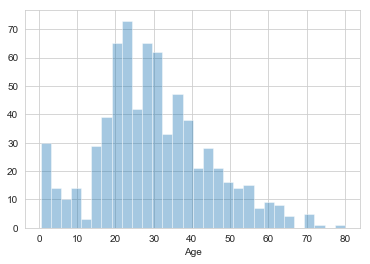
</div>

接着我们查看上船的人中的亲属关系，发现大多数人都是0个亲属或者一个亲属，说明大多数都是单独出行。

<div align=center>
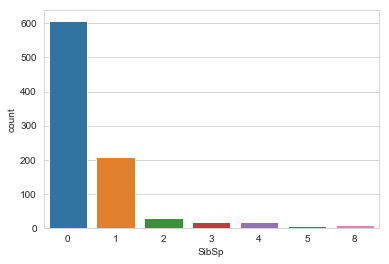
</div>

接着我们查看一下票价分布，可以看到大多数人的票价比较便宜。

<div align=center>
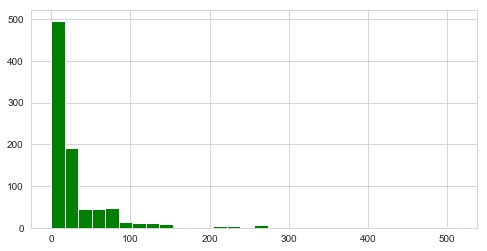
</div>


## 数据预处理
首先我们需要对数据中的缺失值和一些非数值特征进行预处理。对于缺失值我们可以考虑两类处理方法，一类是使用特征的均值或者是频数最大的特征去填充缺失值，第二类是定义一个函数，根据某些特性来确定缺失值。对于非数值特征，我们可以将其转换为categorical特征，比如性别，就可以变成一个二值特征，男性是0，女性是1。除此之外，还需要扔掉一些无效的特征，比如大多数的数据都缺少的特征。

## 模型训练和预测
我们采用`sklearn`里面实现好的模型进行训练，几乎所有经典的机器学习模型在里面都有实现，比如svm，random forest 等等，然后用训练好的模型对测试集进行预测。在模型训练的时候可以采用交叉验证和格点搜索等方法，同时也可以采用Ensemble中的方法。


# Implementation
## 数据准备
数据已经存放在本仓库中，也可以通过[比赛界面](https://www.kaggle.com/c/titanic/data)进行数据下载。将下载好的数据放在项目文件夹中即可。

里面一共有11种不同的信息
```python
{'PassengerId', 'Survived', 'Pclass', 'Name', 'Sex', 'SibSp', 'Parch', 'Ticket', 'Fare', 'Cabin', 'Embarked'}
```

通过 `baseline.ipynb`，我们可以得到下面的数据展示
<div align=center>
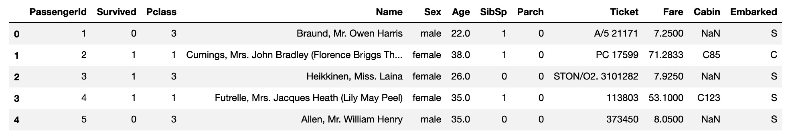
</div>


## 数据预处理
对于数据缺失，我们可以用下面的代码去填充均值

```python
test_feat['Fare'].fillna(test['Fare'].mean(), inplace=True)
```
这里我们对测试集中的`Fare`特征进行了填充

如果这个值有一些特点，那么我们可以定义一个函数来实现，比如考虑到年龄和船舱等级可能有一定的关系
<div align=center>
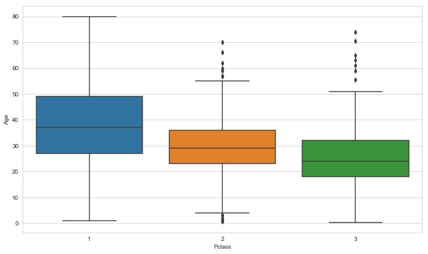
</div>

我们发现船舱等级高的人一般年龄比较大，所以可以用下面的函数去实现缺失值的填充

```python
def infer_age(cols):
    Age = cols[0]
    Pclass = cols[1]
    
    if pd.isnull(Age):
        if Pclass == 1:
            return 37
        elif Pclass == 2:
            return 29
        else:
            return 24
    else:
        return Age

train['Age'] = train[['Age', 'Pclass']].apply(infer_age, axis=1)
```

对于非数值特征，我们需要转换成categorical的形式，可以使用下面的代码
```python
sex = pd.get_dummies(train['Sex'])
```
接着我们得到了下面的效果
<div align=center>
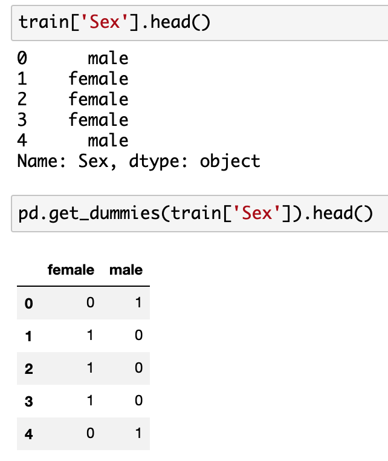
</div>


## 模型以及训练
得到处理好的数据之后，我们可以开始训练模型，示例代码里面使用了最简单的`logistic regression`，所有的代码都在`baseline.ipynb`中。 


## 结果分析
用训练好的模型在验证集上进行测试，可以得到precision，recall，f1 score等数值分析结果

<div align=center>
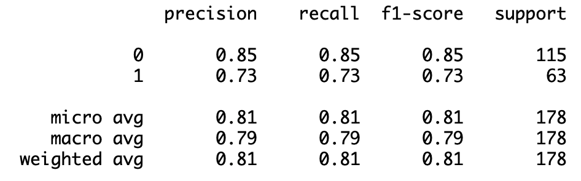
</div>


# Evaluation
我们的测试脚本也在 `baseline.ipynb` 中实现了，通过输入所有测试集的数据，经过模型得到预测的结果，然后进行结果的提交。

我们会在本地创建一个预测的结果 `submission.csv`，我们将这个文件提交到 kaggle，可以得到类似下面的比赛结果。

<div align=center>
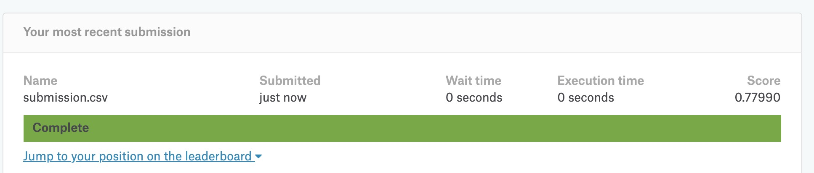
</div>

通过这个结果可以判断你的模型性能的好坏。